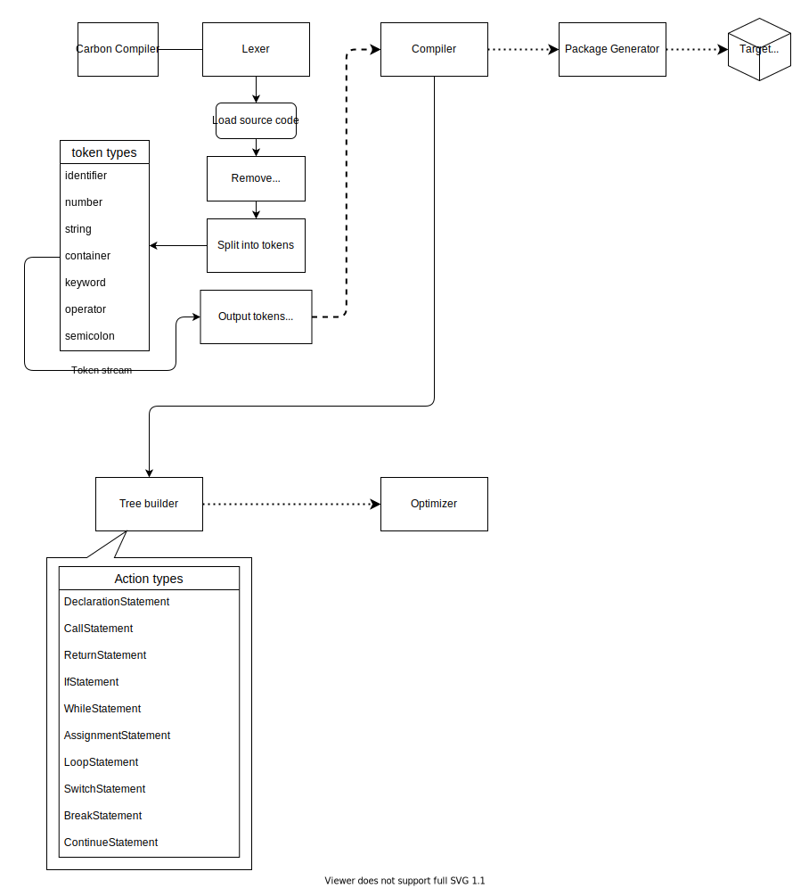

**The Carbon Programming Language**
# carbon-lang_compiler

## Current status

Refractoring lexer and parser base models... Slow progress

## Components

The compiler has 4 parts
- Lexer
- Parser
- Optimizer
- Package generator

Lexer and Parser has already completed in *Project Loop 1*

## Project Map

## License
